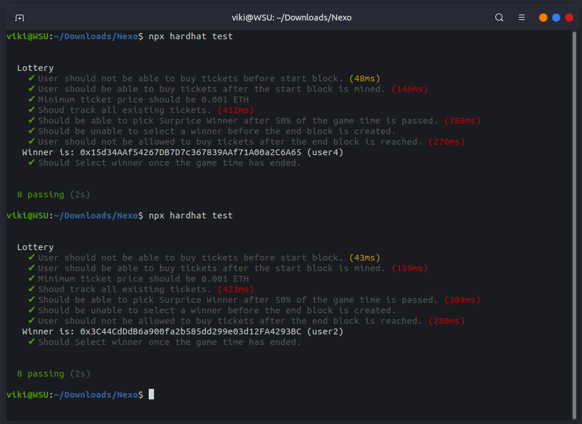

# Nexo Task.


# Setup
1. Install packages
```bash
npm install
npm install @openzeppelin/contracts
npm install @openzeppelin/contracts-upgradeable
```

2. Perform tests.
```bash
npx hardhat test
```

# Screenshots



